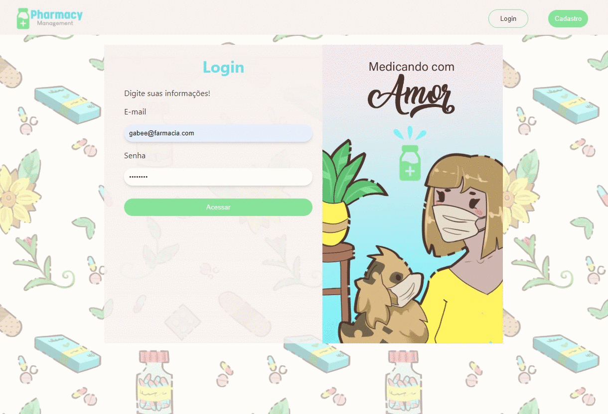

<h1 align="center">

</h1>
<h1>

</h1>
<h2>🏦PharmacyManagement </h2>
O sistema PharmacyManagement é o segundo projeto do curso DEVinHouse turma CLAMED do módulo 1. Nesse sistema existe um esquema de login e cadastro. Entrando no site logo depois de logado direciona para a página de mapa, onde mostra as farmácias cadastradas. Na aba de medicamentos tem uma lista dos medicamentos cadastrados. Por último existe as páginas de cadastro de farmácia e cadastro de medicamentos. No cadastro de farmácia existe uma API para buscar as informações do endereço pelo CEP, e logo depois outra API que pega os dados do endereço e busca pela geolocalização.

---

<h2>💉Tecnologias Utilizadas </h2>
As tecnologias utilizadas foram: JavaScript, React, HTML5 e CSS3.
 
As artes e design foram criadas por mim utilizando o Adobe Photoshop.

<h2>🩹Tipo de licença </h2>
Licença MIT

---
Desenvolvido 🌙 por:
 
<h1 align="center">

</h1>

